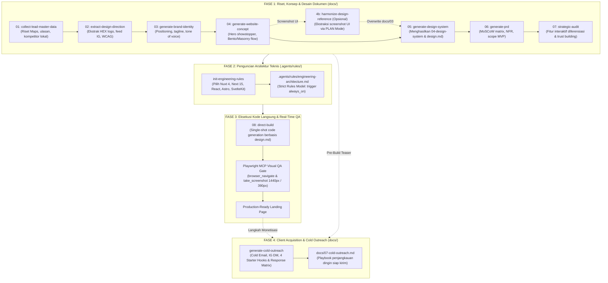

# Agency Website Skill Pack: Anti-Slop Landing Page Engine

<div align="center">


<br/>

**Orkestrasi AI Agentic terintegrasi untuk mengubah data mentah klien bisnis/brand lokal (logo, Instagram feed, Google Maps reviews) menjadi landing page produksi kelas agensi (Awwwards/FWA level) dalam hitungan menit.**

[Cara Pakai Cepat](#-the-1-command-agency-experience) • [Masalah yang Diatasi](#-masalah-yang-diatasi-the-problem) • [Solusi & Filosofi](#-solusi-dan-filosofi-the-agency-model) • [Alur Kerja Pipeline](#-alur-kerja-pipeline-end-to-end) • [Katalog Skill](#-katalog-lengkap-skill) • [Panduan Mulai Cepat](#-panduan-mulai-cepat-quick-start) • [Dokumen Desain Ganda](#-arsitektur-dokumen-desain-ganda)

</div>

---

## ⚡ The 1-Command Agency Experience

Jalankan seluruh siklus agensi secara otomatis dari riset pasar hingga koding siap produksi cukup dengan **satu baris perintah**:

```bash
/build-site [Nama Bisnis, Kategori/Layanan, Kota]
```

#### 💡 Contoh Nyata:
```bash
/build-site SmileCraft Dental, Klinik Gigi Estetik & Veneer, Surabaya
```

> **Apa yang terjadi selanjutnya secara otomatis?**  
> 1. 🔍 **Intelligence Gathering:** AI meriset reputasi Google Maps lokal, testimoni autentik, dan kelemahan kompetitor sekitar (`docs/00-master-data.md`).
> 2. 🎨 **Visual Palette Extraction:** AI mengekstrak moodboard dan warna brand asli, tervalidasi WCAG AA via skrip Python (`docs/01-design-direction.md`).
> 3. 🎯 **Brand Positioning:** Merumuskan value proposition tajam, tone of voice alami anti-slop, tanpa kata klise AI, dan tanpa em dash (`docs/02-brand-identity.md`).
> 4. 🏛️ **Agency Art Direction:** Merancang blueprint Hero showstopper, Dynamic Bento Grid, dan atmospheric depth (`docs/03-website-concept.md`).
> 5. 📐 **Dual Design Architecture:** Menghasilkan panduan stakeholders (`docs/04`) dan spesifikasi teknikal 8-bab (`docs/design.md`) berstandar fluid clamp typography.
> 6. 📋 **PRD & Strategic Audit:** Menyusun batasan MoSCoW MVP dan menyuntikkan 1–2 fitur diferensiasi interaktif (`docs/05` & `docs/06`).
> 7. 🔒 **Engineering Architecture Lock:** Mengunci aturan teknis framework pilihan (Nuxt 4 / Next 15 / React / Astro / SvelteKit).
> 8. 💻 **Direct Build & Playwright Visual QA:** AI langsung menulis kode frontend produksi lengkap dan memvalidasi tampilan Desktop (1440px) & Mobile (390px) via Playwright MCP.
> 
> *Catatan: Jika butuh lampiran logo atau konfirmasi framework, AI akan bertanya langsung secara in-line tanpa menutup alur kerja, lalu otomatis lanjut hingga selesai!*

---

## 🛑 Masalah yang Diatasi (The Problem)

Membangun initial landing page untuk prospek bisnis lokal atau klien *high-class* biasanya terjebak di antara dua dilema besar:

```
                  ┌─────────────────────────────────────────────────────────┐
                  │                DILEMA PENGEMBANGAN UI                   │
                  └─────────────────────────────────────────────────────────┘
                                       │
            ┌──────────────────────────┴──────────────────────────┐
            ▼                                                     ▼
┌──────────────────────────────────────┐  ┌──────────────────────────────────────┐
│       PENDEKATAN AI BIASA / TEMPLATE │  │          KODING MANUAL DARI NOL        │
├──────────────────────────────────────┤  ├──────────────────────────────────────┤
│ ❌ AI-Slop & Tampilan Datar / Murahan │  │ ⚠️ Memakan waktu 3–7 hari kerja      │
│ ❌ Flexbox monoton (3 kartu seragam) │  │ ⚠️ Biaya eksplorasi awal terlalu mahal│
│ ❌ Gradient ungu-biru generik         │  │ ⚠️ Riset brand & pasar terpisah-pisah│
│ ❌ Zero motion (tanpa smooth scroll) │  │ ⚠️ Rentan kelelahan saat soft pitch  │
│ ❌ Kotak placeholder abu-abu kosong  │  │                                      │
│ ❌ Copywriting klise "modern & aman" │  │                                      │
└──────────────────────────────────────┘  └──────────────────────────────────────┘
                                       │
                                       ▼
                  ┌─────────────────────────────────────────┐
                  │    ✨ SOLUSI: AGENCY WEBSITE SKILL PACK  │
                  │   Bespoke, Asset-Derived, Anti-Slop,    │
                  │       Single-Shot Direct Build          │
                  └─────────────────────────────────────────┘
```

### Matriks Perbandingan:

| Parameter | AI Slop / Template Gratisan | Koding Manual Konvensional | ✨ Agency Website Skill Pack |
|---|---|---|---|
| **Sumber Desain** | Warna & font acak dari model | Moodboard manual di Figma | **100% Organik dari Aset Klien (Logo, IG, Maps)** |
| **Tata Letak (Layout)** | Flexbox monoton 3 card identik | Custom CSS manual | **Dynamic Bento Grids & Pinterest/Masonry Flow** |
| **Atmosfer Latar** | Putih polos atau hitam pekat | Asset ilustrasi mahal | **Ambient Radial Glows & Organic Noise Texture** |
| **Pengalaman Gerak (Motion)** | Zero motion / fade-in kaku | Setup GSAP berjam-jam | **Default Lenis Smooth Scroll & Parallax Physics** |
| **Aset Citra Dummy** | Kotak abu-abu "Placeholder" | Download manual di web | **Kurasi Foto Unsplash Riil dengan Filter Khusus** |
| **Waktu Siap Pitch** | 10 menit (kualitas rendah) | 3–5 hari kerja | **< 20 Menit (Kualitas Agensi Kelas Dunia)** |
| **Penjamin Mutu Visual** | Tidak ada | Inspeksi manual mata | **Real-Time Visual QA Gate via Playwright MCP** |

---

## 💎 Solusi dan Filosofi (The Agency Model)

Skill pack ini mengubah peran agen AI dari sekadar *coding assistant* menjadi **tim agensi digital terintegrasi** yang terdiri dari:
1. **Senior Business Intelligence:** Menggali reputasi lokal, kelemahan kompetitor sekitar, dan ulasan Google Maps riil (`docs/00-master-data.md`).
2. **Brand Strategist & Visual Designer:** Mengekstrak palet warna HEX asli dari logo/feed media sosial, memetakan pilar emosional, dan merumuskan positioning unik (`docs/01` & `docs/02`).
3. **World-Class Creative Director:** Menyusun konsep hero showstopper, ritme storytelling antar-section, dan tata letak anti-mainstream (`docs/03-website-concept.md`).
4. **Principal Design System Architect:** Memetakan CSS variables, skala tipografi Google Fonts kontras tinggi, dan menghasilkan berkas spesifikasi teknikal mendalam (`docs/design.md`).
5. **Senior Technical PM & UX Auditor:** Menyusun PRD dengan batasan MoSCoW tegas dan menyuntikkan fitur interaktif diferensiasi (*frontend-only*) (`docs/05` & `docs/06`).
6. **Lead Engineer Executor:** Mengunci arsitektur teknis secara ketat (`engineering-architecture.md`), mengeksekusi kode secara langsung (`direct-build`), dan memvalidasi tampilan via Playwright MCP.
7. **Lead Outbound & Conversion Strategist:** Menyusun playbook penjangkauan dingin (Cold Email, Instagram DM, 4 Starter Hooks, dan Response Matrix) berbasis solusi dan konsep visual hasil riset untuk segera memonetisasi landing page ke prospek bisnis (`docs/07-cold-outreach.md`).

---

## 🚀 Alur Kerja Pipeline (End-to-End)

Proses pengembangan dibagi ke dalam **4 Fase Terpadu**:



---

## 📦 Katalog Lengkap Skill

| Skill / Perintah | Peran Persona | Output Utama | Deskripsi & Kegunaan |
|---|---|---|---|
| [**/build-site**](.agents/workflows/build-site.md) | Principal Agency Lead | Autonomous End-to-End Delivery | **Workflow Autopilot:** Mengeksekusi seluruh siklus dari riset lead, brand, konsep, design system, hingga live coding & Playwright QA secara berkesinambungan tanpa henti. |
| [`/skillpack-guide`](.agents/skills/skillpack-guide/SKILL.md) | Principal Workflow Architect | Diagnosa status CLI & Next Action | Membimbing developer di terminal, memindai progress pipeline saat ini, dan merekomendasikan perintah berikutnya. |
| [`/collect-lead-master-data`](.agents/skills/01-collect-lead-master-data/SKILL.md) | Senior Business Intelligence | `docs/00-master-data.md` | Menggali profil bisnis, analisis ulasan Google Maps riil, dan celah kompetitor lokal terdekat. |
| [`/extract-design-direction`](.agents/skills/02-extract-design-direction/SKILL.md) | Senior Brand Designer | `docs/01-design-direction.md` | Mengekstrak palet warna HEX autentik, rasio kontras WCAG, mood visual, dan theming dari logo & IG. |
| [`/generate-brand-identity`](.agents/skills/03-generate-brand-identity/SKILL.md) | Senior Brand Strategist | `docs/02-brand-identity.md` | Merumuskan value proposition, hook tagline ramah konversi, tone of voice, dan resonansi emosional. |
| [`/generate-website-concept`](.agents/skills/04-generate-website-concept/SKILL.md) | Executive Creative Director | `docs/03-website-concept.md` | Merancang konsep agensi anti-slop: Hero showstopper, ritme bento/masonry, dan riset lib via **Context7 MCP**. |
| [`/harmonize-design-reference`](.agents/skills/harmonize-design-reference/SKILL.md) | Principal Design Lead | Overwrite `docs/03`, sync `04` & `05` | Membedah screenshot referensi UI via **PLAN-first mode** (Traffic Light Filter: Adopt/Adapt/Reject) tanpa merusak brand identity. |
| [`/generate-design-system`](.agents/skills/05-generate-design-system/SKILL.md) | Principal Design System Architect | `docs/04-design-system.md` & `docs/design.md` | Menghasilkan panduan stakeholder (`04`) dan spesifikasi teknikal 8-bab mendalam (`design.md`) untuk acuan koding AI. |
| [`/generate-prd`](.agents/skills/06-generate-prd/SKILL.md) | Technical Product Manager | `docs/05-prd.md` | Menyusun matriks MoSCoW, spesifikasi NFR performa (Lighthouse 90+), dan batasan ruang lingkup MVP siap pitch. |
| [`/audit-and-enhance-docs`](.agents/skills/07-strategic-audit/SKILL.md) | Principal UX Auditor | `docs/06-strategic-audit.md` | Menyuntikkan 1–2 fitur interaktif diferensiasi (*frontend-only*) dan arsitektur trust building non-generik. |
| [`/init-engineering-rules`](.agents/skills/init-engineering-rules/SKILL.md) | Principal Engineering Architect | `.agents/rules/engineering-architecture.md` | Menginisiasi dan mengunci 14 bab aturan teknis mengikat (`trigger: always_on`) sesuai framework & styling pilihan. |
| [`/direct-build`](.agents/skills/08-direct-build/SKILL.md) | Lead Product Engineer | Kode aplikasi lengkap + Visual QA | Menulis seluruh kode frontend produksi berbasis `design.md` dan memvalidasinya secara realtime via Playwright MCP. |
| [`/cold-outreach`](.agents/skills/generate-cold-outreach/SKILL.md) | Lead Outbound Strategist | `docs/07-cold-outreach.md` | Menyusun playbook penjangkauan dingin (Cold Email, IG DM, 4 Starter Hooks, Response Matrix, dan Follow-up) berbasis solusi & riset. |
| **`frontend-design`** | Design Studio Lead | Guardrails Estetika Subjek | Menghindari klise AI (*no cream+terracotta, no black+acid green, no SaaS card kit*), fokus *Spend Boldness in One Place*. |
| **`antislop-ui`** | Visual Quality Gatekeeper | Dose Caps & Decoration Filter | Menegakkan batas dosis ketat: glassmorphism maks 1–2, glow maks 1–2, hierarki radius, nol emoji pada teks UI. |
| **`antislop-human`** | Accessibility Specialist | Validasi Kontras WCAG AA | Memvalidasi kontras teks 4.5:1 dan non-teks 3:1 via Python `contrast-check.py`, navigasi keyboard `:focus-visible`. |
| **`antislop-copywriting`** | Human Prose Specialist | Copywriting Bebas AI Tells | Menghapus seluruh kosakata klise AI (*unlock, elevate, seamless*), larangan em dash (`—`), kalimat aktif dengan aktor jelas. |
| **`antislop-layoutmobile`** | Mobile Layout Architect | Mobile Reflow & Zero Leak | Menegakkan mobile sebagai reflow tersendiri, fluid clamp type, tap targets minimal 44x44px, zero horizontal overflow. |

---

## 🛡️ The 5-Pillar Anti-Slop Quality Armor

Setiap proses di dalam pipeline ini wajib melewati 5 lapis filter mutu spesialis untuk menjamin tampilan dan kode yang dihasilkan berada di level agensi kelas atas:

```
┌─────────────────────────────────────────────────────────────────────────────┐
│                    THE 5-PILLAR ANTI-SLOP QUALITY ARMOR                     │
├─────────────────────────────────────────────────────────────────────────────┤
│ 1. frontend-design       → Estetika berakar industri, no-cliché AI          │
│ 2. antislop-ui           → Dose caps ketat (glass & glow maks 1-2, no emoji)│
│ 3. antislop-human        → Uji kontras WCAG AA 4.5:1 via Python & keyboard  │
│ 4. antislop-copywriting  → Diksi natural, zero AI buzzwords, no em-dash     │
│ 5. antislop-layoutmobile → Mobile reflow, fluid clamp, tap targets 44x44px  │
└─────────────────────────────────────────────────────────────────────────────┘
```

---

## 🎨 Arsitektur Dokumen Desain Ganda

Repositori ini menerapkan pemisahan tugas dokumen desain yang presisi untuk menghindari ambiguitas antara manusia dan agen AI:

```
                             ┌─────────────────────────────────────────┐
                             │       PROSES GENERASI SISTEM DESAIN     │
                             │       (/generate-design-system)         │
                             └─────────────────────────────────────────┘
                                                  │
                      ┌───────────────────────────┴───────────────────────────┐
                      ▼                                                       ▼
┌───────────────────────────────────────────┐   ┌───────────────────────────────────────────┐
│     docs/04-design-system.md              │   │     docs/design.md                        │
├───────────────────────────────────────────┤   ├───────────────────────────────────────────┤
│ 👥 UNTUK PEMANGKU KEPENTINGAN (STAKEHOLDERS)│   │ 🤖 UNTUK AGEN AI & DEVELOPER (TECHNICAL)   │
│ • Narasi pilar visual yang mudah dipahami │   │ • Spesifikasi teknikal 8-bab baku         │
│ • Makna filosofis warna & tipografi       │   │ • CSS Variables mapping (:root)           │
│ • Panduan visual komponen tingkat tinggi  │   │ • Blueprint CSS Grid Bento & Masonry      │
│ • Disetujui bersama klien & manajemen     │   │ • Hairline borders, noise & ambient glow  │
│                                           │   │ • Lenis smooth scroll runtime config      │
│                                           │   │ • Registry URL foto Unsplash teroptimasi  │
│                                           │   │ • Acuan utama penulisan kode saat build   │
└───────────────────────────────────────────┘   └───────────────────────────────────────────┘
```

---

## 🛠️ Dukungan Multi-Framework (Strict Rules Model)

Anda bebas menggunakan framework frontend apa pun. Jalankan `/init-engineering-rules` untuk mengunci stack yang dipilih ke dalam [`.agents/rules/engineering-architecture.md`](.agents/rules/engineering-architecture.md):

- **Nuxt 4 + Tailwind CSS v4:** App Directory (`/app`), Vue 3 Composition API, `@tailwindcss/vite`, SSR/SSG.
- **Next.js 15 + Tailwind CSS v4:** App Router (`/src/app`), React 19, Server Components default, `@tailwindcss/postcss`.
- **React 19 + Vite + Tailwind CSS v4:** Modern SPA/SSG, `@tailwindcss/vite`, TypeScript strict.
- **Astro 5 + Tailwind CSS v4:** Islands Architecture, HTML-first zero-JS baseline, `@tailwindcss/vite`.
- **SvelteKit 2 + Svelte 5 + Tailwind CSS v4:** Svelte 5 Runes reactivity (`$state`), SSR/SSG.
- **Custom Stack:** Konfigurasi mandiri (Remix, SolidStart, Laravel Blade + Tailwind) mengikuti standar baku 14 bab.

---

## 🔌 Integrasi Ekosistem MCP & Tooling

1. **Context7 MCP (`resolve-library-id` $\rightarrow$ `query-docs`):**
   - Agen wajib memanggil Context7 untuk meriset dokumentasi pustaka animasi mutakhir (Lenis, GSAP, Spline, Three.js, Lucide) agar sintaks API dijamin kompatibel dengan framework terkunci.
2. **`find-skills` (`npx skills find`):**
   - Agen dipersilakan mengadopsi skill pendukung dari ekosistem terbuka `skills.sh` jika memerlukan kapabilitas khusus (animasi lanjutan, SVG shader, optimasi performa).
3. **Playwright MCP (`browser_navigate` $\rightarrow$ `browser_take_screenshot`):**
   - Bertindak sebagai **Quality Gate Visual Real-Time** saat `/direct-build`. Agen menjalankan dev server lokal, mengambil screenshot Desktop (1440px) dan Mobile (390px), serta melakukan *self-critique* visual sebelum menyatakan pekerjaan selesai.

---

## 🏷️ Tata Kelola Dokumen (Semantic Versioning)

Semua berkas di folder `docs/` dikelola secara ketat melalui aturan [`.agents/rules/document-governance.md`](.agents/rules/document-governance.md) (`trigger: always_on`):

Setiap dokumen diawali format header wajib:
```markdown
# [Judul Dokumen]: [Nama Bisnis/Brand]

> **Document Version:** X.Y.Z | **Status:** [Draft / Approved] | **Last Updated:** YYYY-MM-DD  
> **Governing Agent/Role:** [Peran Agen Pembuat]

### Revision Changelog
| Version | Date | Author / Role | Changes Summary |
|---|---|---|---|
| X.Y.Z | YYYY-MM-DD | [Peran Agen] | [Ringkasan perubahan terverifikasi] |

---
```

- **MAJOR (X.0.0):** Perombakan fundamental arah brand, reposisi pasar, atau restrukturisasi total konsep/layout.
- **MINOR (X.Y.0):** Penambahan fitur baru, kalibrasi referensi UI (`/harmonize-design-reference`), atau penambahan token desain baru.
- **PATCH (X.Y.Z):** Perbaikan typo, penghalusan copywriting, atau koreksi HEX kecil.

---

## 🏁 Panduan Mulai Cepat (Quick Start)

### ⚡ 1-Line Quick Installation (Any Existing Project)

Pasang dan kunci seluruh ekosistem skill pack ini ke proyek apa pun secara instan via satu baris perintah:

```bash
curl -fsSL https://raw.githubusercontent.com/or-abdillh/agency-website-skillpack/main/install.sh | bash
```

> *Skrip installer interaktif ini akan otomatis mendeteksi framework proyek target Anda (Nuxt, Next.js, Vite+React, Astro, atau SvelteKit), mengunci arsitektur teknis yang sesuai, dan memasang seluruh rules, skills, serta workflow.*

---

### 🚀 Opsi Utama: 1-Command Autonomous Delivery (/build-site)

Jalankan seluruh siklus agensi dari pengumpulan data bisnis, riset Google Maps, ekstraksi palet, penulisan konsep, spesifikasi teknis, hingga koding dan visual QA secara otomatis tanpa henti:

```bash
/build-site [Nama Bisnis, Kategori, Kota]
```

> *AI akan mengeksekusi Step 1 s.d. Phase B secara berkesinambungan. Jika memerlukan input spesifik (seperti unggahan logo atau pilihan framework), AI akan bertanya langsung secara in-line tanpa menghentikan sesi.*

---

### 🛠️ Opsi Alternatif: Eksekusi Modular (Per-Tahap)

Jika Anda ingin menjalankan atau meregenerasi tahap tertentu secara terisolasi:

#### 0. Navigasi & Diagnosis Pipeline Kapan Saja
Panggil copilot alur kerja:
```bash
/skillpack-guide
```
Atau jalankan skrip status terminal kapan saja langsung dari bash shell:
```bash
bash .agents/skills/skillpack-guide/scripts/status.sh
```

#### 1. Eksekusi Riset & Konseptualisasi Brand
Mulai dengan memasukkan identitas prospek bisnis target:
```bash
/collect-lead-master-data
```
*Lanjutkan ke langkah 2 hingga 4:*
```bash
/extract-design-direction
/generate-brand-identity
/generate-website-concept
```

### 2. Kalibrasi Referensi UI (Opsional)
Jika Anda memiliki screenshot landing page inspirasi (Awwwards / Dribbble):
```bash
/harmonize-design-reference
```
*AI akan membedah referensi via PLAN Mode (Traffic Light Matrix: Adopt/Adapt/Reject) dan meminta konfirmasi Anda sebelum meng-overwrite `docs/03-website-concept.md`.*

### 3. Hasilkan Sistem Desain & PRD
```bash
/generate-design-system
/generate-prd
/audit-and-enhance-docs
```
*Langkah ini secara otomatis menghasilkan `docs/04-design-system.md` dan spesifikasi teknikal `docs/design.md`.*

### 4. Kunci Arsitektur & Jalankan Build
Pilih stack framework target:
```bash
/init-engineering-rules
```
Lalu jalankan eksekusi koding instan dengan validasi Playwright MCP:
```bash
/direct-build
```

---

## 📂 Struktur Direktori Repositori

```
├── .agents/
│   ├── rules/
│   │   ├── engineering-architecture.md  # Aturan arsitektur aktif (trigger: always_on)
│   │   ├── agency-design-standard.md    # Standar visual agensi & anti-slop (trigger: always_on)
│   │   └── document-governance.md       # Standar tata kelola SemVer (trigger: always_on)
│   ├── workflows/
│   │   └── lead-ideate-pipeline.md      # Panduan roadmap orchestrator
│   └── skills/                          # Katalog skill modular
├── docs/                                # Output artefak perencanaan & desain
│   ├── 00-master-data.md                # Data intelijen bisnis & ulasan Maps
│   ├── 01-design-direction.md           # Ekstraksi HEX logo & moodboard
│   ├── 02-brand-identity.md             # Positioning, persona & copywriting
│   ├── 03-website-concept.md            # Blueprint hero showstopper & storytelling
│   ├── 04-design-system.md              # Panduan desain untuk stakeholders
│   ├── design.md                        # Spesifikasi teknikal 8-bab untuk AI build
│   ├── 05-prd.md                        # Matriks MoSCoW & spesifikasi NFR
│   └── 06-strategic-audit.md            # Fitur diferensiasi & trust architecture
├── AGENTS.md                            # Direktif operasional untuk agen AI
└── README.md                            # Dokumentasi resmi repositori
```
